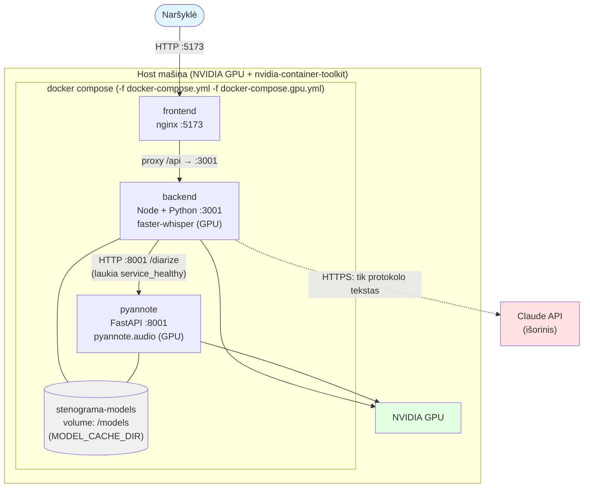

# Stenograma

**Susitikimų protokolų generatorius: garsas → transkripcija → struktūruotas protokolas.**

Stenograma paverčia susitikimo garso įrašą (arba jau turimą transkripciją) į tvarkingą,
redaguojamą protokolą — su darbotvarke, aptartais klausimais, nutarimais ir veiksmų
sąrašu su atsakingais asmenimis bei terminais.

Projektas suprojektuotas kaip **provider architektūra**: transkribavimo ir LLM tiekėjai
keičiami per konfigūraciją (`.env`), o ne kodo perrašymą. **Backend'as yra privalomas** —
frontend'as niekada nekviečia jokio LLM tiesiai iš naršyklės.

---

## Reference implementation vs. Adapter examples

Šiame projekte yra 7 transkribavimo, 5 diarizacijos ir 4 LLM tiekėjų adapteriai. Tai
**sąmoningas architektūros pasirinkimas parodyti provider-pattern plotį**, NE bandymas
apsimesti, kad visi 16 yra production-ready. Kad tai būtų aišku iš pirmo žvilgsnio:

**🟢 Reference implementation — realiai paleista ir patikrinta šioje aplinkoje:**
- `MockTranscriptionProvider`, `MockLLMProvider`, `MockDiarizationProvider` — automatiniais testais.
- `ClaudeProvider` — su realiu `ANTHROPIC_API_KEY`.
- `FasterWhisperEmbeddedProvider` — su vartotojo pateiktu tikru `faster-whisper` modeliu, per pilną HTTP srautą.

**⚪ Adapter examples — kodas parašytas pagal tiekėjo viešą API kontraktą, bet NETESTUOTA su realiu raktu:**
Azure Speech, Google Speech, Deepgram, OpenAI Whisper, GPT, Gemini, AssemblyAI,
pyannote.ai, faster-whisper (server profilis). Šie parodo, KAIP naują tiekėją
pridėti prie architektūros (žr. `providers/*/index.js` factory pattern), bet prieš
naudojant produkcijoje kiekvieną reikia patikrinti su realiu raktu atskirai.

Jei jums reikia tik vieno konkretaus tiekėjo (pvz. tik Claude + Whisper) - likusius
galite tiesiog ignoruoti arba ištrinti iš `providers/` katalogo, architektūra to
nereikalauja visų vienu metu.

---

## Statusas: kaip skaityti likusią šio README dalį

Šis projektas yra architektūrinės demonstracijos stadijoje. Kad README neklaidintų, kiekvienas
komponentas žemiau pažymėtas viena iš trijų kategorijų:

- ✅ **Implemented** — parašyta, paleista šioje aplinkoje ir automatiniais testais patikrinta, kad veikia.
- 🧪 **Mocked** — realiai veikia be jokio API rakto, bet grąžina supaprastintą (ne tikro LLM/ASR) rezultatą pagal heuristikas.
- ⚙️ **Interface only** — kodas parašytas pagal tiekėjo oficialų API kontraktą, bet **nebuvo testuotas su realiu apmokamu raktu**. Patikrinkite prieš diegdami produkcijoje.

---

## Sistemos reikalavimai

| Komponentas | Minimalu | Rekomenduojama | Pastabos |
|---|---|---|---|
| **RAM** | 8 GB | 16 GB | Mock/demo veikia ir su mažiau; GPU stackas (Whisper+pyannote) imlesnis |
| **CPU** | 4 branduoliai | 8 branduoliai | CPU transkripcija (`small` modelis) veikia, bet lėčiau nei GPU |
| **GPU** | nebūtina | RTX 3060+ (12 GB VRAM) | Tik GPU transkripcijai/diarizacijai. `small` modeliui užtenka ~2 GB VRAM, `large-v3` fp16 ~4–5 GB |
| **Diskas** | 10 GB | 30 GB | Demo/CPU ~10 GB; GPU Docker image'ai (CUDA/Torch/pyannote) realiai 25–30 GB |
| **Node.js** | 20 | 20 LTS | Backend + frontend |
| **Python** | 3.10 | 3.11 | pyannote/whisper servisai (jei naudojami) |

Priklauso nuo profilio: **demo/mock** – veikia beveik bet kur (net be GPU, be Docker,
`make demo`). **CPU transkripcija** – 8 GB RAM pakanka. **GPU stackas su diarizacija**
– rekomenduojama 16 GB RAM + NVIDIA GPU + `nvidia-container-toolkit` (patikrina
`make preflight-gpu`). RunPod/cloud detalės – [`RUNPOD.md`](RUNPOD.md).

## Architektūra

```
┌──────────────────┐      HTTPS       ┌───────────────────────┐
│                   │ ───────────────▶│   Backend (Express)   │
│   React frontend   │                 │                       │
│  (redaguojamas     │◀─────────────── │  /api/transcribe      │
│   protokolas,       │      JSON       │  /api/generate        │
│   /api/health       │                 │  /api/audit (⚠ auth) │
│   statuso indikat.) │                 └──────────┬────────────┘
└──────────────────┘                                │
              ┌──────────────────┬─────────────────┼────────────────────┐
              │                  │                  │                    │
       TranscriptionProvider DiarizationProvider LLMProvider      JSON Schema +
              │            (NEPRIKLAUSOMAS!)        │              audit log +
    ┌────┬────┼────┬─────┐   ┌────┬────┬────┬─────┐ ┌────┼────┬─────┐  repair retry
    │    │    │    │     │   │    │    │    │     │ │    │    │     │
 Whisper FW Azure Google Deep- none inline mock pyan- Claude GPT Gemini Mock
 🧪intf  ⚙️  ⚙️    ⚙️    gram  ✅   ✅    ✅  note/  ✅    ⚙️   ⚙️    ✅
                        ⚙️              cloud/
                                        assembly
                                        ⚙️
```

Transkribavimas ir diarizacija (kalbėtojų atskyrimas) yra **du nepriklausomi komponentai**
su atskirais env kintamaisiais (`TRANSCRIPTION_PROVIDER`, `DIARIZATION_PROVIDER`) — todėl
derinys "Whisper transkripcija + pyannote diarizacija" dabar galimas, nors Whisper pats
diarizuoti nemoka. Detalės: [`backend/README.md`](backend/README.md#diarizacija--nepriklausomas-komponentas-nuo-transkribavimo).

API raktai gyvena **tik backend'e** (`process.env`). Frontend'as backend'o adresą
tikrina per `GET /api/health` ir aiškiai parodo, ar jis pasiekiamas — jei ne, protokolo
generuoti negalima (jokio "tylaus" grįžimo prie tiesioginio LLM kvietimo iš naršyklės nėra).

### Duomenų srautas

Kelias nuo garso įrašo iki galutinio protokolo (Mermaid - renderinasi GitHub'e):


Pastaba: transkribavimas ir diarizacija vyksta **lygiagrečiai to paties audio atžvilgiu**,
tada sujungiami (kalbėtojo etiketė priskiriama kiekvienam teksto segmentui pagal laiką).
Async job'ai (`/api/transcribe-jobs`, `/api/jobs`) būtini, nes 4 val. įrašo apdorojimas
gerokai viršija HTTP proxy timeout'us (pvz. RunPod 100s).

---

## Greitas startas

**Linux/macOS/RunPod - viena komanda** (realiai patikrinta švarioje aplinkoje):
```bash
./setup.sh          # mock/CPU: backend+frontend+faster-whisper priklausomybės, .env, diagnostika
./setup.sh --gpu    # + GPU: tikrina nvidia-smi/CUDA, paruošia pyannote diarizaciją (venv, CUDA Torch)
make demo           # ĮSITIKINTI, kad viskas veikia: pilnas srautas per sekundes (mock, be raktų)
```
`make demo` paleidžia backend'ą, atlieka visą srautą ir parodo:
```
✔ Upload — audio priimtas
✔ Transcription — "Jonas: Labas, pradedam…"
✔ LLM — užklausa priimta
✔ Protocol generated — struktūrizuotas protokolas paruoštas
System ready.
```
Numatytoji konfigūracija (`./setup.sh` be argumentų) - **demo (mock) režimas,
veikia iš karto be jokių API raktų**; ji apima backend, frontend ir faster-whisper
transkripciją, bet **NE pyannote diarizaciją** (tam reikia `--gpu`, kuris paruošia
atskirą pyannote venv su GPU Torch ir patikrina `HUGGINGFACE_TOKEN`). Realiam AI žr.
`backend/.env` komentarus. **Windows** - žr. diegimo skyrių žemiau (žingsniai
rankiniai, realiai patikrinti). **RunPod/GPU** - žr. [`RUNPOD.md`](RUNPOD.md).
Diagnostika bet kada: `cd backend && npm run doctor`.

## Kasdienis paleidimas (aplinka jau paruošta)

Kai `setup.sh` jau paleistas ir modeliai atsisiųsti (pvz. grįžote prie to paties
RunPod pod'o), darbo pradžiai NEreikia iš naujo diegti - tik paleisti servisus:

**GPU su diarizacija (pilnas realaus darbo režimas):**
```bash
make gpu                                   # paleidžia pyannote + backend (API) kartu
# jei portai užimti (pvz. RunPod nginx ant 3001/8001):
make gpu BACKEND_PORT=4001 PYANNOTE_PORT=9001
```
`make gpu` paleidžia **backend API + pyannote** ir laiko juos veikiančius (stabdyti -
`Ctrl+C`). Reikia `HUGGINGFACE_TOKEN` (pyannote modeliui). Pirmą kartą po pod'o
paleidimo modeliai kraunami į VRAM - kelios sekundės.

**Frontend (naršyklė) - jei reikia, paleidžiamas ATSKIRAI** (`make gpu` jo neįjungia):
```bash
cd frontend && npm run dev                 # http://localhost:5173 (ar RunPod proxy URL)
```
Jei backend'as ne ant 3001, frontend'ui nurodykite jį per `frontend/.env`
(`VITE_BACKEND_URL`) arba naudokite nginx `/api` proxy (žr. RUNPOD.md).

**Patikrinti, kad viskas gyva:**
```bash
make status                                # health būsena
make verify BACKEND_PORT=4001              # pilnas end-to-end smoke prieš veikiantį stacką
```

**Sustabdyti:** `Ctrl+C` (jei `make gpu` fronte). Docker atveju - `make down`.

## Komponentų statusas

**Realaus 4 val. lietuviško posėdžio įrašo testas** atskleidė ir ištaisė realų
trūkumą: `tiny` modelis praktiškai netinka lietuvių kalbai (haliucinuoja), `small`
jau duoda naudotiną tekstą; be to, protokolo pilnumo balas klaidingai rodė 80%
vietoj tikrų 60%, kai LLM grąžindavo `["Nenurodyta"]` vietoj tuščio masyvo -
abi problemos ištaisytos (`meeting_v3` promptas + `completeness()` logika), su
regresijos testais. Detalus aprašymas - žr.
[`backend/README.md`](backend/README.md#realaus-audio-testas-tikras-4-val-posėdžio-įrašas).

**Video failai (.mp4/.webm su vaizdo IR garso takeliu) veikia** - realiai
patikrinta su tikru `faster-whisper` modeliu ir `ffmpeg` sugeneruotais testiniais
failais (H.264+AAC ir VP8+Opus). Biblioteka automatiškai ištraukia audio takelį,
vaizdas ignoruojamas. Detalus paaiškinimas ir apribojimai (kiti tiekėjai
nepatikrinti, dydžio vs. trukmės klausimas) - žr.
[`backend/README.md`](backend/README.md#video-failai-mp4webm-su-vaizdo-ir-garso-takeliu---realiai-patikrinta).

| Komponentas | Statusas | Pastaba |
|---|---|---|
| Frontend UI (redagavimas, TXT/CSV/Word eksportas, live įrašymas per Web Speech API) | ✅ | Veikia savarankiškai, bet protokolo generavimui reikalauja veikiančio backend'o |
| Backend serveris + visi endpoint'ai | ✅ | Paleista ir patikrinta automatiniais testais (žr. „Testai" žemiau) |
| `MockTranscriptionProvider` | 🧪 | Grąžina fiksuotą pavyzdinį (diarizuotą) rezultatą, nepriklausomai nuo įkelto failo turinio |
| `MockLLMProvider` | 🧪 | Ištraukia pavadinimą/datą/dalyvius/veiksmus iš REALIOS jūsų transkripcijos paprastomis regex heuristikomis — nėra tikras LLM, bet reaguoja į įvestį |
| `ClaudeProvider` | ✅ | Veikia su `ANTHROPIC_API_KEY`, patikrinta |
| `WhisperProvider` (OpenAI) | ⚙️ | Kodas funkcionalus, netestuota su realiu raktu |
| `DeepgramProvider` | ⚙️ | Kodas funkcionalus, netestuota su realiu raktu |
| `GPTProvider`, `GeminiProvider` | ⚙️ | Kodas pagal viešą API kontraktą, netestuota su realiu raktu |
| `AzureSpeechProvider`, `GoogleSpeechProvider` | ⚙️ | Dokumentuota sąsaja, reikalauja patikrinimo prieš diegiant |
| `FasterWhisperProvider` (lokalus, "server" profilis) | ⚙️ | Reikalauja atskirai paleisto lokalaus serverio |
| `FasterWhisperEmbeddedProvider` (lokalus, "desktop" profilis) | ✅ | Realiai patikrinta su `tiny` IR `small` modeliais, įskaitant TIKRĄ 4 val. lietuvišką posėdžio įrašą (ne tik sintetinį TTS balsą) - visas HTTP srautas `/api/transcribe` → provideris → Python subprocess → `faster-whisper`. `tiny` pasirodė netinkamas lietuvių kalbai, `small` - naudotinas. Žr. `backend/README.md` „Realaus audio testas" ir „Faster-Whisper: du diegimo profiliai" |
| `MockDiarizationProvider` | ✅ | Deterministiniai intervalai, patikrinti su merge logika (`tests/mergeDiarization.test.js`) |
| `PyannoteDiarizationProvider` (lokalus) | ⚙️ | Reikalauja atskirai paleisto lokalaus serverio; veikia su bet kokiu `TRANSCRIPTION_PROVIDER`, įskaitant Whisper |
| `PyannoteCloudDiarizationProvider`, `AssemblyAIDiarizationProvider` | ⚙️ | Kodas pagal viešą API kontraktą, netestuota su realiu raktu |
| JSON Schema validacija + repair retry | ✅ | Testuota (žr. `tests/protocolSchema.test.js`) |
| Transcript grounding check (leksinis persidengimas) veiksmų atžvilgiu | 🧪 Implementuota (leksinis) | `utils/groundingCheck.js` - leksinis persidengimas, ne semantinis fact-checking. Žr. Roadmap dėl embedding-based versijos |
| Tikras OOXML `.docx` eksportas | ✅ Implementuota | `docx` npm paketas, generuojamas naršyklėje (`Packer.toBlob`). Patikrinta - `file` komanda patvirtina tikrą "Microsoft Word 2007+" formatą, ne HTML. Trūksta: įmonės logotipo/šablono (žr. Roadmap) |

---

## Saugumo numatytosios reikšmės (svarbu prieš viešą diegimą)

Ankstesnės versijos turėjo keletą MVP-lygio saugumo spragų, kurios dabar ištaisytos:

| Rizika | Sprendimas |
|---|---|
| **⚠️ Docker prievadai + dev-by-default = viešas neautentifikuotas API** (žr. „Docker" skyrių žemiau) | `docker-compose.yml` prievadai susieti su `127.0.0.1`, ne `0.0.0.0` - numatytai pasiekiami TIK lokaliai |
| API raktas frontend'e | Pašalinta — frontend'as **neturi jokio** tiesioginio LLM kvietimo, tik kviečia backend'ą |
| Hardcoded `BACKEND_URL` kode | Skaitomas iš `VITE_BACKEND_URL` (`import.meta.env`) - deployment metu keičiamas `.env`, ne kodas |
| `/api/audit` viešai atviras | `middleware/auditAuth.js` — reikalauja `AUDIT_API_KEY` header'io; produkcijoje (`NODE_ENV=production`) be jo uždarytas |
| `/api/generate`, `/api/transcribe` be autentifikacijos | `middleware/apiKeyAuth.js` — reikalauja `API_KEY`; produkcijoje be jo endpoint'ai uždaryti (503). **Tai bendras raktas, ne per-user auth** - žr. „Autentifikacija ir viešas diegimas" backend README |
| Frontend negali saugiai naudoti `API_KEY` | `VITE_API_KEY` NEBŪTINA - jei naudojama, raktas matomas viešame JS bundle'e. Tinka TIK vidiniam/lokaliam tinklui. Viešam deploy'ui reikalingas reverse proxy arba pilna auth sistema - žr. backend README |
| `/api/health` viešai rodo tiekėjų/modelių pavadinimus | Produkcijoje pagal nutylėjimą grąžina tik `{status:"ok"}` (`HEALTH_DETAILS`) |
| Nėra rate limiting brangiems endpoint'ams | `express-rate-limit` - numatyta 20 užklausų / 15 min vienam IP (`RATE_LIMIT_MAX_REQUESTS`) |
| Ilgas susitikimas + sinchroninis `/api/generate` = ilgas HTTP laukimas | `POST /api/jobs` + `GET /api/jobs/:id` - asinchroninis variantas, žr. backend README |
| Visas audio failas skaitomas į RAM prieš siunčiant tiekėjui | Iš dalies sumažinta (`multer.diskStorage` upload metu), bet `fs.readFile` prieš API kvietimą vis tiek pilnai perskaito failą - sąžiningai dokumentuotas MVP limitas, ne tikras streaming |
| CORS `*` pagal nutylėjimą | Numatyta `http://localhost:5173`; `*` reikalauja sąmoningo pasirinkimo (spėja įspėjimu konsolėje) |
| Laisvas tiekėjo perjungimas per užklausą | `llmProviderOverride` / `provider` laukai veikia tik su `ALLOW_PROVIDER_OVERRIDE=true` (numatyta — išjungta), ir tik pagal whitelist |
| 200 MB audio į RAM (`multer.memoryStorage`) | Pakeista į `multer.diskStorage` (streamina į laikiną failą, ne atmintį) + numatytas limitas sumažintas iki 50 MB (`MAX_UPLOAD_MB`) |
| Bet koks failas priimamas kaip "audio" | `fileFilter` tikrina MIME tipą IR/ARBA plėtinį prieš whitelist (mp3/wav/m4a/mp4/webm/ogg/aac/flac, įskaitant `video/mp4`/`video/webm` - žr. žemiau) |
| Pavojingas `LLM_PROVIDER=claude` numatytoje `.env.example` | Pakeista į `LLM_PROVIDER=mock` — be rakto backend'as dabar veikia iš karto, o ne kris pirmoje užklausoje |
| Kabantys API kvietimai be timeout | Visi išoriniai kvietimai per `utils/httpClient.js` — `AbortController` timeout (`API_TIMEOUT_MS`, numatyta 90s) + vienas automatinis pakartojimas 5xx/tinklo klaidoms |
| Prompt injection per transkripciją | `prompts/meeting_v2.js` (numatyta versija) eksplicitiškai nurodo modeliui, kad transkripcija yra DUOMENYS, ne instrukcijos |
| `docker compose up` demo neveikdavo iš karto (`NODE_ENV=production` + tuščias `API_KEY` = 503) | `docker-compose.yml` numatyta `NODE_ENV=development`; produkcijai reikia sąmoningo perjungimo (žr. komentarą faile) |
| Failo validacija tik pagal pavadinimą/MIME (apeinama pervadinus) | `utils/audioMagicBytes.js` - papildoma failo TURINIO (magic bytes) patikra. Sąžiningai NE antivirusinis skenavimas |
| Klaidos pranešime atskleidžia per daug (raktai, endpoint'ai) | `utils/sanitizeError.js` - tikros (500) vidinės klaidos niekada nepasiekia kliento pilnu tekstu; pilnas tekstas visada logguojamas serveryje |
| Nėra jokio "ar veiksmas tikrai buvo transkripcijoje" patikrinimo | `utils/groundingCheck.js` - leksinio persidengimo heuristika, pažymi žemo pasitikėjimo veiksmus frontend'e. Sąžiningai NE semantinis/embedding tikrinimas |
| Async jobai (`/api/jobs`) niekada nešalinami iš atminties | `utils/jobStore.js` TTL - COMPLETED/FAILED jobai automatiškai išvalomi po `JOB_TTL_MINUTES` (numatyta 60 min) |
| Docker nebuvo CI testuojamas | CI dabar turi atskirą `docker` job'ą: `docker compose build` + realus konteinerio paleidimas ir `/api/health` smoke testas |

**Praktinis veiksmų planas, kaip šias rizikas mažinti pagal jūsų diegimo scenarijų
(lokalus / vidinis / viešas) - žr. [`DEPLOYMENT_CHECKLIST.md`](DEPLOYMENT_CHECKLIST.md).**

---

## Testai ir CI

```bash
cd backend
npm install
npm test        # node --test - 118 testų, visi mock provideriais, be jokių API raktų
npm run check   # node --check kiekvienam .js failui
```

Testų aprėptis (backend):
- `tests/protocolSchema.test.js` — JSON schema validacija (privalomi laukai, tipai, repair prompt).
- `tests/prompt.snapshot.test.js` — meeting prompt šablono snapshot testas (apsaugo nuo netyčinių pakeitimų).
- `tests/mergeDiarization.test.js` — laiko persidengimu paremtos diarizacijos sujungimo logikos unit testai.
- `tests/generate.route.test.js` — `/api/generate` per HTTP (supertest), įskaitant provider override atmetimą.
- `tests/transcribe.route.test.js` — `/api/transcribe` per HTTP, įskaitant validaciją ir override atmetimą.
- `tests/diarization.route.test.js` — `none`/`inline`/atskiro tiekėjo (`mock`) diarizacijos režimai per HTTP.
- `tests/providerOverride.route.test.js` — `ALLOW_PROVIDER_OVERRIDE=true` scenarijai (whitelist patikra).
- `tests/jobStore.test.js` + `tests/jobStoreRedis.test.js` — job store (async, in-memory + Redis su fake klientu).

Naršyklinis E2E (`frontend/e2e/`, Playwright): pilnas srautas įklijuoti tekstą →
generuoti protokolą → eksportuoti DOCX (mock provideriai). Paleidimas: `npm run test:e2e`
(reikia `npx playwright install chromium`).

GitHub Actions (`.github/workflows/ci.yml`) kiekvienam push/PR paleidžia: `npm ci` →
`node --check` → `npm test` → smoke test → whisper/pyannote kontrakto testai → E2E
(Playwright su tikra Chromium).

### Ką realiai patikrina CI vs. kas tikrinta rankiniu būdu

Svarbu neklaidinti: **žalias CI ženklas NEreiškia, kad GPU kelias patikrintas.**
GitHub standartinis runner'is GPU neturi, o `test_real_gpu.py` be `HUGGINGFACE_TOKEN`
praleidžiamas. Tikslus atskyrimas:

**✅ CI verified (automatiškai, kiekvienam push):**
- backend: 128 `node:test` testai (mock tiekėjai; įsk. jobStore, jobRunner/BullMQ su fake Redis, fileStorage)
- frontend: 24 Vitest testai + `vite build`
- pyannote: `/health` diagnostika + `/diarize` kontraktas su mock pipeline (9 testai)
- whisper-server: `/health` + `/transcribe` kontraktas su mock modeliu (8 testai)
- **naršyklinis E2E (Playwright, Chromium): (a) įklijuoti tekstą → protokolas → DOCX; (b) pilnas audio upload → polling → protokolas → DOCX**
- bazinis (CPU) `docker compose build` + backend konteinerio `/api/health` smoke

**🔧 Manually verified (šioje ar ankstesnėse sesijose, be GPU):**
- faster-whisper transkripcija su tikru `small` modeliu, tikras 4 val. lietuviškas įrašas (CPU)
- pilna backend→whisper-server HTTP grandinė su mock modeliu (undici form-data bug'as rastas ir ištaisytas)
- `smoke-gpu.sh` end-to-end (WAV → transkripcija → protokolas) su tikru modeliu (CPU)
- `configure.sh` visi režimai + sugeneruoto `.env` realus paleidimas
- `preflight-gpu.sh` / `support-bundle.sh` (maskavimas, HF prieigos šaka su netikru tokenu)

**❌ NOT verified (reikia GPU/Docker aplinkos - patikrinkite savo mašinoje):**
- CUDA image build (`Dockerfile.whisper.gpu`, `pyannote-server/Dockerfile.gpu`, `whisper-server/Dockerfile.gpu`)
- reali GPU transkripcija (`device=cuda`) embedded IR server profiliuose
- realaus pyannote modelio įkėlimas ir diarizacija
- pilnas GPU end-to-end per `docker compose ... gpu.yml`
- Docker GPU passthrough patikra realioje GPU mašinoje
- **BullMQ restart recovery su tikru Redis** (`tests/queueRecovery.integration.test.js`
  praleidžiamas be `REDIS_URL`; logika testuota su fake Redis, bet realų „sustabdyk
  backend, paleisk, patikrink ar jobas tęsiamas" reikia paleisti su tikru Redis:
  `REDIS_URL=redis://localhost:6379 node --test tests/queueRecovery.integration.test.js`)
- **E2E su tikra naršykle NEBUVO paleistas šioje kūrimo aplinkoje** (Chromium atsisiuntimas blokuotas); testas struktūriškai patikrintas (`playwright test --list`) ir paruoštas CI'ui

### Architektūros trade-off'ai (sąmoningi MVP apribojimai)

Šis projektas yra apgalvotas **portfolio MVP**, ne production-ready enterprise
sistema. Keli sąmoningi architektūriniai sprendimai, kuriuos vertėtų žinoti prieš
platesnį diegimą:

- **Job'ai: inline, persistent state, arba tikra BullMQ eilė** (`queues/`, `workers/`).
  Be `REDIS_URL` - darbas vykdomas HTTP procese (inline; tinka dev/desktop, bet
  backend restartas nutraukia vykdomą jobą). Su `REDIS_URL` - **tikra BullMQ eilė**:
  HTTP endpoint'as TIK įdeda jobą ir grąžina 202, darbą vykdo ATSKIRAS worker
  procesas. Atskiros eilės (`queues/transcriptionQueue.js`, `protocolQueue.js`) ir
  worker'iai (`workers/transcriptionWorker.js`, `protocolWorker.js`) - galima skalauti
  nepriklausomai (transkripcija imlesnė GPU nei LLM). Tai duoda: restart recovery,
  retry+backoff, stalled job recovery, dead-letter (failed po visų bandymų), kelis
  worker'ius (atominis job reservation), bendrą audio storage (worker pasiekia failą
  pagal raktą, ne lokalų /tmp; failas trinamas po galutinio statuso, ne tarp retry).
  Kas dar liko 2 etapui: PostgreSQL rezultatams, MinIO/S3 vietoj Docker volume.
- **Transkribavimas: embedded ARBA server.** `faster-whisper-embedded` (numatyta):
  Node spawn'ina Python procesą kiekvienai užklausai, modelis kraunamas iš naujo -
  paprasta, tinka desktop scenarijui. `faster-whisper-server` (persistentus
  `whisper-server/`): modelis įkeltas VIENĄ kartą, laikomas VRAM tarp užklausų -
  mažesnis latency, kontroliuojamas VRAM, aiškus concurrency limitas, lengviau
  skalauti. Server profilis simetriškas pyannote architektūrai; `docker-compose.server.yml`
  paleidžia abu persistentus servisus. Pasirenkama per `TRANSCRIPTION_PROVIDER`.
- **Frontend backend adresas:** numatytai frontend'as naudoja **santykinį `/api`**,
  kurį nginx proxy'ina į backendą (žr. `frontend/nginx.conf`). Tad tas pats frontend
  image tinka **bet kuriam domenui** (localhost, RunPod proxy, serveris) be
  perbuildinimo, ir **nėra CORS**. Absoliutus `VITE_BACKEND_URL` reikalingas tik jei
  frontend ir backend skirtinguose hostuose BE proxy (retas atvejis).
- **`VITE_API_KEY` patenka į naršyklės bundle** - tinka tik lokaliam/uždaram
  naudojimui. Viešam diegimui reikėtų session/OAuth ar server-side proxy, pridedančio
  raktą. Dokumentuota `.env.example`.
- **Naršyklinis E2E testas (Playwright)** dengia pagrindinį srautą: įklijuoti
  tekstą → generuoti protokolą → eksportuoti DOCX (mock provideriai, be raktų/GPU).
  Vykdomas CI'e su tikra Chromium naršykle. Ką dar būtų verta pridėti: failo upload
  + transkribavimo polling per naršyklę (dabar E2E dengia teksto įklijavimo kelią).

Šie punktai nėra klaidos - tai normalūs MVP vs enterprise trade-off'ai. Jie čia
išvardyti, kad README neklaidintų dėl production-readiness.

## Greitas paleidimas

### Backend (privalomas)

```bash
cd backend
cp .env.example .env
npm install
npm start
```

Numatytieji nustatymai (`TRANSCRIPTION_PROVIDER=mock`, `LLM_PROVIDER=mock`) veikia iškart,
be jokių API raktų.

Realiam tiekėjui — pakeiskite `.env`:

```bash
TRANSCRIPTION_PROVIDER=whisper
LLM_PROVIDER=claude
OPENAI_API_KEY=sk-...
ANTHROPIC_API_KEY=sk-ant-...
```

### Frontend

Pilnas Vite + React projektas (`frontend/`), ne pavienis failas:

```bash
cd frontend
cp .env.example .env    # VITE_BACKEND_URL=http://localhost:3001
npm install
npm run dev              # http://localhost:5173
```

Adresas skaitomas iš `VITE_BACKEND_URL` (`import.meta.env`) - **jokio hardcoded URL
kode**, deployment metu tereikia pakeisti `.env` (arba build-time kintamąjį), ne kodą.

Jei backend nepasiekiamas, sąsaja tai aiškiai parodo ir generavimo mygtukas išjungiamas —
jokio "demo" kelio per tiesioginį LLM kvietimą iš naršyklės nebėra.

---

## API

| Endpoint | Metodas | Aprašymas | Apsauga |
|---|---|---|---|
| `/api/health` | GET | Aktyvūs tiekėjai (produkcijoje detalės paslėptos pagal nutylėjimą - žr. `HEALTH_DETAILS`) | — |
| `/api/transcribe` | POST (multipart) | Audio failas → transkripcija (SINCHRONINIS - žr. `/api/transcribe-jobs` HTTP proxy su trumpu timeout atveju, pvz. RunPod) | `API_KEY`, rate limit, failo dydžio/formato validacija, provider override tik su `ALLOW_PROVIDER_OVERRIDE` |
| `/api/transcribe-jobs` | POST (multipart) | Asinchroninis `/api/transcribe` - grąžina `jobId` iš karto (202). Frontend'as naudoja ŠĮ pagal nutylėjimą. | `API_KEY`, rate limit |
| `/api/transcribe-jobs/:id` | GET | Transkribavimo jobo statuso/rezultato apklausa | `API_KEY`, rate limit |
| `/api/generate` | POST (JSON) | Transkripcija → struktūruotas protokolas (SINCHRONINIS - žr. `/api/jobs` ilgiems susitikimams) | `API_KEY`, rate limit, provider/prompt override tik su `ALLOW_PROVIDER_OVERRIDE` |
| `/api/jobs` | POST (JSON) | Asinchroninis `/api/generate` - grąžina `jobId` iš karto (202) | `API_KEY`, rate limit |
| `/api/jobs/:id` | GET | Joba statuso/rezultato apklausa (polling) | `API_KEY`, rate limit |
| `/api/audit` | GET | Audit log įrašai | `x-audit-key` header (arba uždaryta produkcijoje) |

Pilna dokumentacija: [`backend/README.md`](backend/README.md).

---

## Technologijos

**Frontend:** React + Vite, Tailwind (core utility klasės), Web Speech API, PapaParse (CSV eksportui), lucide-react.
**Backend:** Node.js 20+, Express, Multer (diskStorage), express-rate-limit.
**Testai:** backend — `node:test` (built-in) + Supertest (107 testai); frontend —
Vitest (24 testų: 19 grynoms `src/utils.js` funkcijoms + 5 komponento/integracijos
testai `App.jsx` su React Testing Library ir mocked `fetch` - backend health
statusas, generavimo srautas, klaidų rodymas). **Sąžiningai:** komponento testai
apima tik dalį elgsenos (health status, paste→generate srautas, klaidos) - NĖRA
padengta: audio upload srautas, protokolo redagavimas po generavimo, eksportai
(.docx/.csv/.txt), diarizacijos pasirinkimas, live įrašymas. Nėra ir Playwright/
Cypress E2E testo (naršyklė → upload → transcribe → generate → edit → export) -
tai aiškiai kitas žingsnis, ne baigtas darbas.
**Konteinerizacija:** Docker (backend + frontend/nginx), `docker-compose.yml` (nebuvo build-testuota šioje aplinkoje - žr. skyrių „Docker").
**CI:** GitHub Actions.
**Architektūros šablonas:** Strategy/Provider pattern LLM ir transkribavimo tiekėjams, config-driven factory.

---

## Roadmap

**Milestone 1 – Reliable processing pipeline ✅** (persistent job orchestration,
BullMQ workers, Redis-backed state, dedicated Whisper service, browser E2E, protocol
generation pipeline, Docker deployment, health/readiness checks). Pilnas sąrašas –
[`CHANGELOG.md`](CHANGELOG.md). Kitas: **Milestone 2 – sauga ir duomenų valdymas**
(OIDC auth, multi-tenancy, PostgreSQL, MinIO/S3, retention, audit).

- [x] ~~"Desktop" transkribavimo profilis be atskiro serverio~~ → `faster-whisper-embedded` providerio lygmeniu implementuotas (žr. `backend/README.md`). **Sąžiningai:** tai NĖRA supakuota desktop programa (Electron/Tauri .exe/.dmg) - tai vis dar Node backend'as + React frontend'as, tiesiog transkribavimo providerio viduje nebėra HTTP serviso, kurį reikėtų paleisti atskirai. Pilnas "Stenograma Desktop" paketavimas (viena instaliuojama programa be `npm start`/`docker compose`) - kitas žingsnis, jei to reikia.
- [x] ~~Automatinis fact-checking~~ → leksinis grounding check implementuotas (`utils/groundingCheck.js`). Liko: **semantinis** fact-checking (embedding similarity arba antras LLM validacijos žingsnis) - dabartinė heuristika nepagauna perfrazuotų (bet teisingų) teiginių.
- [x] ~~Tikras OOXML `.docx` eksportas~~ → implementuota (`docx` npm paketas, generuojama naršyklėje). Liko: įmonės logotipas/šablonas/spalvos, jei reikia firminio stiliaus - dabar naudojamas bendras neutralus formatavimas.
- [x] ~~Local transcription concurrency control~~ → `utils/concurrencyLimiter.js` semaforas ribojantis vienalaikius `faster-whisper-embedded` subprocess'us (`FASTER_WHISPER_MAX_CONCURRENCY`), patikrinta laiko matavimo testu.
- [x] ~~Nereikalinga `node-fetch` priklausomybė~~ → pašalinta, naudojamas Node 20 native `fetch` (projektas jau reikalauja Node 20+).
- [x] ~~Bent vienas frontend komponento/integracijos testas~~ → `frontend/src/App.test.jsx` (React Testing Library + mocked fetch): backend health statusas, generavimo srautas, klaidų rodymas. Liko neišbandyta: audio upload srautas, protokolo redagavimas, eksportai, diarizacijos pasirinkimas, live įrašymas.
- [ ] PDF eksportas.
- [ ] Realios įrašo TRUKMĖS (ne tik failo dydžio) tikrinimas prieš apdorojimą (`ffprobe` ar panaši biblioteka) - žr. paaiškinimą `backend/README.md` "Faster-Whisper" skyriuje.
- [x] ~~Playwright/Cypress E2E testas (naršyklė → audio upload → transcribe → generate → edit → export)~~ → **Milestone 1**: Playwright E2E (`frontend/e2e/`) dengia įklijuoto teksto IR pilno audio upload → polling → protokolas → DOCX srautus + klaidų kelius. Vykdomi CI'e su Chromium. Liko: redagavimo srautas, diarizacijos pasirinkimas naršyklėje.
- [ ] Audit log perkėlimas iš atminties į SQLite/Postgres (su retention politika, PII redagavimu, paieška, eksportu). *(Milestone 2)*
- [x] ~~Tikra job queue vietoj in-memory saugyklos~~ → **Milestone 1**: BullMQ eilė su atskirais worker procesais (`workers/transcriptionWorker.js`, `protocolWorker.js`), retry+backoff, dead-letter, stalled recovery, atominis job reservation; Redis-backed persistentus state su fallback į in-memory. Liko (Milestone 2): PostgreSQL ilgalaikiams rezultatams.
- [ ] Tikras audio streaming tiekėjui (šiuo metu visas failas skaitomas į RAM prieš siunčiant - žr. backend README).
- [ ] Antivirusinis audio failų skenavimas (šiuo metu tik magic-bytes signature patikra, ne pilnas turinio skenavimas).
- [ ] Realių `Azure`/`Google`/`GPT`/`Gemini`/`Whisper`/`Deepgram`/`pyannote-cloud`/`AssemblyAI` tiekėjų testavimas su mokamais raktais.
- [x] ~~`faster-whisper-embedded`: patikrinti su realia (ne TTS) žmogaus kalba, lietuvių kalba~~ → patikrinta su tikru 4 val. lietuvišku posėdžio įrašu, `tiny` ir `small` modeliais (žr. `backend/README.md` "Realaus audio testas"). Liko: `medium`/`large-v3` modeliai, GPU (`device=cuda`), pilnas ilgas (>1 val.) įrašas ištisai, keli kalbėtojai/diarizacija su realiu įrašu.
- [ ] Per-user autentifikacija (sesijos/OAuth) vietoj bendro `API_KEY`, jei diegiama kaip viešas SaaS su realiais vartotojais.

---

## Docker

```bash
cp backend/.env.example backend/.env   # užpildykite pagal poreikį
docker compose up --build
```

Paleidžia backend'ą (`127.0.0.1:3001`) ir frontend'ą (nginx, `127.0.0.1:5173`) kartu,
prieinamus TIK iš jūsų mašinos. `docker-compose.yml` perduoda visus reikiamus env
kintamuosius abiem servisams (žr. failą - `VITE_*` kintamieji frontend'ui perduodami
kaip **build args**, nes Vite juos įkompiliuoja į bundle'ą build metu, ne skaito runtime).

**⚠️ Du dalykai, kuriuos verta žinoti PRIEŠ keičiant numatytus nustatymus:**

1. **Prievadai sąmoningai susieti su `127.0.0.1`, ne `0.0.0.0`.** Jei pakeisite
   į paprastą `"3001:3001"` (Docker numatytai sietų su `0.0.0.0`) ir paleisite
   šį compose bet kokioje mašinoje su viešu IP - kartu su numatytu
   `NODE_ENV=development` (= be `API_KEY` autentifikacijos) bet kas internete
   galėtų nemokamai naudoti `/api/generate` su jūsų realiu LLM raktu. Tai
   TIKSLIAI atitinka šio README "greito paleidimo" kelią, todėl tai nėra
   egzotiškas kraštutinis atvejis - tai numatytas scenarijus, jei prievadai
   būtų atviri.
2. **`VITE_API_KEY` kaip Docker build arg papildomai nutekėtų per image layers.**
   Be jau paminėto rizikos (raktas matomas JS bundle'e naršyklėje - žr.
   backend README "Autentifikacija ir viešas diegimas"), Docker build ARGs
   išlieka atsekami per `docker history --no-trunc <image>` net PO build'o.
   Jei naudojate `VITE_API_KEY`, laikykite tai vidinio/lokalaus naudojimo
   priemone, o ne viešo image publikavimo (Docker Hub ir pan.) praktika.

**Sąžiningai:** `Dockerfile`/`docker-compose.yml` parašyti pagal standartinius
Node/nginx multi-stage build šablonus. **Šioje sandbox aplinkoje NEBUVO build-testuoti**
(nėra Docker daemon), bet CI (`.github/workflows/ci.yml`, `docker` job'as) kiekvienam
push/PR realiai paleidžia `docker compose build` + backend konteinerį + `/api/health`
smoke testą per GitHub Actions runner'į (kuris Docker turi). Jei matote žalią CI
varnelę prie šio commit'o - Docker setup'as realiai veikia, ne tik sintaksiškai validus.

### Pilnas stackas su GPU ir lokalia diarizacija

Bazinis `docker compose up` paleidžia tik backend+frontend su **mock** tiekėjais
(veikia iš karto be raktų). Realiam darbui su lokalia transkripcija (`faster-whisper`)
ir diarizacija (`pyannote`) yra atskiras GPU override:

```bash
# .env faile nustatykite HUGGINGFACE_TOKEN (pyannote gated modeliui)
docker compose -f docker-compose.yml -f docker-compose.gpu.yml up --build
# arba trumpiau:
make docker-gpu
```

Tai prideda/keičia tris dalykus lyginant su baziniu compose: (1) backend statomas
iš `backend/Dockerfile.whisper.gpu` (CUDA bazinis image + Node + Python + GPU CUDA
bibliotekos, tad `FASTER_WHISPER_DEVICE=cuda` REALIAI veikia konteineryje); (2)
pridedamas `pyannote` diarizacijos servisas iš `pyannote-server/Dockerfile.gpu`
(CUDA image + GPU torch - `torch.cuda.is_available()` bus `True`); (3) GPU
rezervavimas abiem servisams per `deploy.resources`.

**Reikia:** NVIDIA GPU + draiveriai + `nvidia-container-toolkit` host mašinoje, ir
`HUGGINGFACE_TOKEN` (pyannote modelis „gated"). Yra ir CPU variantai
(`Dockerfile.whisper`, `pyannote-server/Dockerfile`) - jie naudojami, jei GPU nėra,
bet dideliems įrašams bus lėti.

### CPU stackas (realus faster-whisper, ne mock)

`make quickstart-cpu` naudoja `docker-compose.cpu.yml` override, kuris įjungia
**realią** lokalią CPU transkripciją (`faster-whisper-embedded`). Be šio override
bazinis compose paleistų `mock` - tad `quickstart-cpu` ir `quickstart` būtų tapatūs.

### Paruošti Docker image'ai (GHCR) - greitesnis diegimas

Numatytai `make quickstart-*` stato image'us lokaliai (CUDA/Torch/pyannote/Whisper -
gali užtrukti). Su publikuotais image'ais galima traukti vietoj statymo:

```bash
export REGISTRY=ghcr.io/jusu-vardas   # jūsų GHCR namespace
make quickstart-gpu                    # traukia REGISTRY image'us (pull), NE stato
# arba priverstinis lokalus build bet kada:
BUILD=1 make quickstart-gpu
```

Logika: **be `REGISTRY`** image vardas yra lokalus (`stenograma-backend:gpu`) ir
quickstart stato lokaliai - jokio bandymo jungtis prie netikro registry. **Su
`REGISTRY`** image tampa `$REGISTRY/stenograma-backend:gpu` ir quickstart traukia
per `docker compose pull`.

⚠️ **STATUSAS: publikavimo workflow ĮJUNGTAS, bet image'ai dar nepublikuoti jūsų
repo.** Publikuoti (vienkartinis veiksmas):

```bash
git tag v1.0.0 && git push --tags   # paleidžia .github/workflows/publish-images.yml
# arba rankiniu būdu: GitHub repo > Actions > "Publish images (GHCR)" > Run workflow
```

Prieš pirmą kartą: repo Settings > Actions > Workflow permissions = "Read and write".
Publikuojami: backend, whisper, pyannote (GPU) + frontend. Po to vartotojai naudoja
`export REGISTRY=ghcr.io/jusu-vardas && make quickstart-gpu` ir traukia paruoštus
image'us vietoj 15-30 min lokalaus build'o.

### Build'o spartinimas (jau įdiegta)

Net statant lokaliai, keli optimizavimai mažina build laiką:
- **BuildKit cache mounts** - pip/npm cache išlieka tarp build'ų (pakartotiniai
  build'ai nesisiunčia tų pačių paketų). `quickstart.sh` įjungia `DOCKER_BUILDKIT=1`.
- **`.dockerignore` visuose servisuose** - `.venv`, `node_modules`, `__pycache__`,
  testai nesiunčiami į build context (mažesnis kontekstas = greitesnis build).
- **Sluoksnių tvarka** - priklausomybės (`package.json`/`requirements.txt`) kopijuojamos
  ATSKIRAI ir prieš kodą, tad kodo pakeitimas nepriverčia iš naujo diegti priklausomybių.
- **Modelio pre-download (optional)** - `whisper-server/Dockerfile.gpu` su
  `--build-arg PREDOWNLOAD_MODEL=1` "įkepa" modelį į image (greitesnis pirmas
  paleidimas, didesnis image). Be jo modelis atsisiunčiamas pirmo paleidimo metu -
  quickstart aiškiai įspėja apie šį laukimą (kad neatrodytų kaip strigimas).

### Profilių izoliacija (svarbu)

Kiekvienas quickstart profilis turi savo compose override, kuris **priverstinai**
nustato esminius kintamuosius - kad profiliai NEPRIKLAUSYTŲ nuo likusio
`backend/.env` (pvz. jei anksčiau per `make configure` pasirinkote GPU+claude, o
paskui paleidžiate `make quickstart` demo):

| Profilis | Override | Priverstinai nustato |
|---|---|---|
| `quickstart` (demo) | `docker-compose.demo.yml` | `TRANSCRIPTION_PROVIDER=mock`, `LLM_PROVIDER=mock`, `DIARIZATION_PROVIDER=none` |
| `quickstart-cpu` | `docker-compose.cpu.yml` | `faster-whisper-embedded`, `device=cpu`, `DIARIZATION_PROVIDER=none` |
| `quickstart-gpu` | `docker-compose.gpu.yml` | `device=cuda`, `DIARIZATION_PROVIDER=pyannote`, pyannote servisas |

Raktai (API_KEY, ANTHROPIC_API_KEY, HUGGINGFACE_TOKEN) visada imami iš
`backend/.env`/shell - profiliai perrašo tik režimo kintamuosius, ne paslaptis.
GPU profilyje **`HUGGINGFACE_TOKEN` privalomas** (preflight `--require-hf` sustabdo
be jo, nes pyannote be tokeno tampa unhealthy ir visas stackas nepasileidžia).

**Patogumas:** kad tokeno nereikėtų eksportuoti kas terminalo sesiją, įrašykite jį
į **šakninį `.env`** (`cp .env.example .env`, tada `HUGGINGFACE_TOKEN=hf_...`).
Tą patį failą automatiškai skaito ir Docker Compose, ir `preflight-gpu.sh` (saugiai -
tik reikšmės ištraukimas, ne `source`). Šakninis `.env` yra `.gitignore` - jokios
paslaptys nepateks į Git.

### Pull vs. build (greitis)

Numatytai `make quickstart-*` bando **traukti** paruoštus image'us (`docker compose
pull`), tada kelia - greita, jei image'ai publikuoti GHCR. Jei registry image'ų
nėra, Compose pastato lokaliai iš `build:` sekcijos. Priverstinis lokalus build:
`BUILD=1 make quickstart-gpu` (arba `make docker-gpu-build`).

**Užfiksuotos priklausomybių versijos:** deterministiniam diegimui (svarbu RunPod
ir kitose ilgaamžėse aplinkose) yra lock failai su konkrečiomis versijomis:
`backend/scripts/requirements-{cpu,gpu}.lock.txt` ir
`pyannote-server/requirements-{cpu,gpu}.lock.txt`. Docker image'ai jau juos naudoja.
faster-whisper stack'o versijos realiai patikrintos (vartotojo sesija); pyannote
versijos - rekomenduojamas suderinamas rinkinys (žr. failų komentarus dėl statuso).

**Sąžiningai:** GPU Dockerfile'ai (CUDA baziniai image'ai, `torch --index-url .../cu124`,
`nvidia-cublas-cu12`) parašyti pagal standartines faster-whisper/pyannote GPU diegimo
instrukcijas, bet **NEBUVO build-testuoti šioje sandbox aplinkoje** (nėra Docker
daemon nei GPU). Bazinio CUDA image tag'o ir CUDA/torch versijų suderinamumą
patikrinkite pirmo build'o metu savo mašinoje. Pyannote serverio `/health` logika
ir `/diarize` kontraktas - realiai išbandyti per FastAPI TestClient
(`pyannote-server/test_server.py`, 3 testai praeina).

## Paleidimo scenarijai (Makefile)

Kad nereikėtų prisiminti ilgų komandų, yra `Makefile` su įvardytais scenarijais.
`make` arba `make help` parodo visą sąrašą. Patogus galutinis rinkinys:

**Vieno mygtuko UX (Docker):**

| Komanda | Ką daro |
|---|---|
| `make quickstart` | Demo/mock stackas viena komanda (build → laukia health → smoke → rodo URL) |
| `make quickstart-cpu` | Lokalus Whisper CPU stackas viena komanda |
| `make quickstart-gpu` | Whisper GPU + pyannote (tikrina Docker GPU passthrough prieš statymą) |
| `make configure` | Interaktyviai sugeneruoja `backend/.env` (režimas + LLM pasirinkimas) |

**Diegimas be Docker:** `make setup` / `make setup-gpu` / `make dev` / `make cpu` /
`make gpu-transcription` / `make pyannote` / `make gpu`.

**Diagnostika ir priežiūra:**

| Komanda | Ką daro |
|---|---|
| `make doctor` | Node, Python, CUDA, ffmpeg, modeliai, diskas, RAM |
| `make status` | Konteinerių ir health būsena |
| `make logs` | Svarbiausi visų servisų logai |
| `make verify` / `make smoke-gpu` | End-to-end: WAV → transkripcija → protokolas per tikrą HTTP |
| `make warmup` | Modelių įkėlimas į cache/VRAM (pirmas realus failas nebus lėtas) |
| `make update` | Nauji Docker image'ai ir saugus restartas |
| `make support-bundle` | Diagnostikos paketas (viskas į vieną failą, slapti duomenys užmaskuoti) |

`make gpu` (be Docker) paleidžia **abu** servisus - pyannote :8001 + backend su
`DIARIZATION_PROVIDER=pyannote`. Docker alternatyva (izoliuota, tikri GPU image'ai):
`make quickstart-gpu`.

**smoke-gpu / verify realiai patikrintas** (CPU režimu su tikru faster-whisper
modeliu): WAV → transkripcija → protokolas per tikrą HTTP API praėjo. Docker/GPU
keliai (`quickstart-*`) - logika parašyta ir sintaksiškai patikrinta, bet pilnas
Docker srautas nebuvo vykdytas šioje aplinkoje (nėra Docker daemon nei GPU).

## Diegimo topologijos

Sistema palaiko keturias tipines konfigūracijas. Visos naudoja tą patį kodą -
skiriasi tik `.env` ir paleidimo būdas.

**1. Lokaliai, demo (be jokių raktų):**
```
[Naršyklė] → [Frontend :5173] → [Backend :3001]
                                    ├─ mock transkripcija
                                    └─ mock LLM
```
`make dev`. Nieko papildomo nereikia. Tinka pademonstruoti sąsają darbdaviui.

**2. Lokaliai, realus darbas (jautrūs įrašai niekur neišeina):**
```
[Naršyklė] → [Frontend] → [Backend] ─ spawn ─→ [Python faster-whisper]  (lokaliai, CPU/GPU)
                              │
                              ├─ HTTP → [pyannote serveris :8001]  (lokaliai, diarizacija)
                              └─ HTTPS → [Claude API]  (TIK protokolo tekstas, ne audio)
```
`make gpu` + atskirai paleistas pyannote serveris. Audio ir transkripcija lieka
jūsų mašinoje; į išorę keliauja tik galutinės transkripcijos tekstas protokolui.

**3. Docker (viena mašina, visas stackas):**
```
docker compose -f docker-compose.yml -f docker-compose.gpu.yml up
   ├─ backend   (Node + Python + faster-whisper, GPU)
   ├─ pyannote  (FastAPI + pyannote.audio, GPU)
   └─ frontend  (nginx)
```
`make docker-gpu`. Viskas viename `docker compose`, modelių cache bendrame volume.

**4. RunPod / nuomojamas GPU serveris:**
```
[Naršyklė] → RunPod HTTP proxy → [Frontend :5173 (0.0.0.0)]
                                        │ nginx /api proxy (vidinis Docker tinklas)
                                        ├→ [backend :3001]  (NEeksponuotas viešai)
                                        └→ [pyannote :8001] (NEeksponuotas viešai)
```
RunPod'ui yra **atskiras** `docker-compose.runpod.yml` (aiškiai atskirtas nuo
lokalaus Docker scenarijaus, kad nesimaišytų):

```bash
export MODEL_CACHE_DIR=/workspace/models   # persistent volume
export HUGGINGFACE_TOKEN=hf_...
make quickstart-runpod
```

Skirtumai nuo lokalaus `quickstart-gpu`: (1) frontend eksponuojamas `0.0.0.0:5173`
(RunPod proxy pasiekia; lokaliai būtų `127.0.0.1`); (2) **vienas viešas prievadas** -
backend ir pyannote pasiekiami tik vidiniu Docker tinklu per nginx `/api` proxy;
(3) RunPod pod nustatymuose atidarykite tik `5173`. Dėl RunPod HTTP proxy kieto 100s
limito **būtina** async `/api/transcribe-jobs` kelias (frontend tai daro
automatiškai). Pilnas žingsnis po žingsnio - žr. [`RUNPOD.md`](RUNPOD.md).

### Deployment diagrama (C4-style, GPU Docker stackas)

Pilno GPU stacko konteineriai ir jų ryšiai (Mermaid - renderinasi GitHub'e):



Svarbu srautui: backend laukia `pyannote` `service_healthy` (modelis realiai
įkeltas) prieš startuodamas; audio ir transkripcija lieka konteineriuose, į išorę
(Claude API) keliauja **tik** galutinės transkripcijos tekstas protokolui, ne garsas.
Modelių cache bendrame volume — RunPod'e nukreipkite į persistent volume per
`MODEL_CACHE_DIR`, kad keli GB nesiųstų kaskart.

---

## Licencija

MIT — žr. [`LICENSE`](LICENSE).
